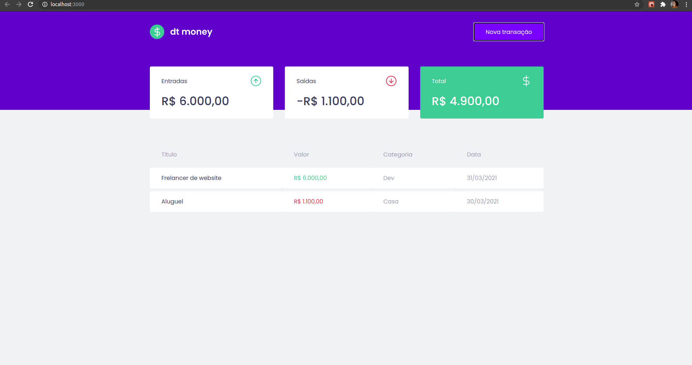
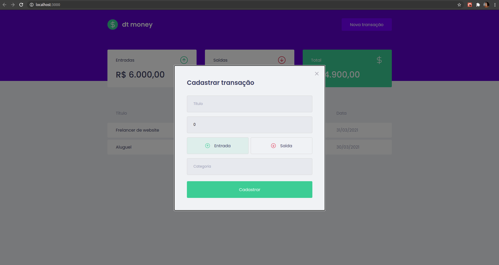

# Resultado

## Tecnologias/Ferramentas utilizadas

- react;
- styled-components;
- react-hooks
- context API
- axios
- miragejs
- polished
- react-modal

## **Demonstração**

## **Nova Transação**

## Contato

Rafael -> [Github](https://github.com/devteles) - **te_teles@hotmail.com**
Linkedin: https://www.linkedin.com/in/rafael-teles-vital-9002946a/
